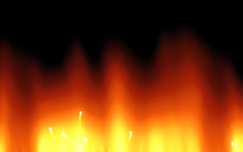

# fire

A [doom-style fire effect](https://fabiensanglard.net/doom_fire_psx/) in Rust, rewritten for looks.



The simulation runs at the classic 320×200 resolution and is displayed in a
960×600 window via a bilinear 3× upscale of the heat field. On top of the
classic bottom-up heat cascade it adds:

- A blackbody-styled 12-stop palette, interpolated in linear light with a
  65536-entry LUT and Bayer dithering — no banding, no muddy oranges.
- A scrolling value-noise cooling map with domain warp, which shapes the
  tall flame tongues and ragged tips.
- Wind shear, ember particles, and a coal-textured bed.
- A half-res bright-pass bloom over the display buffer.

## Install

Grab a binary for your platform from the
[latest release](https://github.com/lra/fire/releases/latest), or build from
source:

```sh
cargo run --release
```

Press <kbd>Esc</kbd> to quit.

## Snapshot mode

Set `FIRE_SNAPSHOT=<dir>` to render a few frames to PPM files in `<dir>` and
exit, instead of opening a window — handy for eyeballing tuning changes:

```sh
FIRE_SNAPSHOT=/tmp/snap cargo run --release
```
