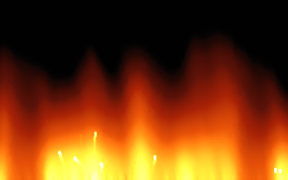

# fire

A [doom-style fire effect](https://fabiensanglard.net/doom_fire_psx/) in Rust, rewritten for looks.



The simulation runs at the classic 320×200 resolution and is displayed in a
960×600 window via a bilinear 3× upscale of the heat field. On top of the
classic bottom-up heat cascade it adds:

- A blackbody-styled 12-stop palette, interpolated in linear light with a
  65536-entry LUT and Bayer dithering — no banding, no muddy oranges.
- A scrolling value-noise cooling map with domain warp, which shapes the
  tall flame tongues and ragged tips.
- Wind shear, ember particles, and a coal-textured bed.
- A half-res bright-pass bloom over the display buffer.

## Install

Grab a binary for your platform from the
[latest release](https://github.com/lra/fire/releases/latest), or build from
source:

```sh
cargo run --release
```

Press <kbd>Esc</kbd> to quit.

## Prebuilt binaries

When the `version` in `Cargo.toml` is bumped on `master`, CI publishes a
[GitHub Release](https://github.com/lra/fire/releases) with archives for:

- Linux x86_64 and ARM64
- macOS ARM64 and x86_64
- Windows x86_64 and ARM64
- Web: `fire-<version>-web.zip` with `index.html` + `fire.wasm`, ready to
  serve from any static host

Each native archive is a single `fire` binary (`.exe` on Windows). Release notes are
generated automatically from commits and pull requests since the previous tag.

To cut a release: bump `version` in `Cargo.toml` (and commit the lockfile if
dependencies changed), merge to `master`. CI tags `v<version>` and uploads the
archives once that tag does not already exist.

## Web (wasm)

The renderer also builds for the browser — no wasm-bindgen or npm, just a
`cdylib` blitted to a canvas by `web/index.html`:

```sh
rustup target add wasm32-unknown-unknown
cargo build --release --target wasm32-unknown-unknown --lib
cp target/wasm32-unknown-unknown/release/fire.wasm web/
python3 -m http.server -d web
```

Then open <http://localhost:8000>. Click the canvas for fullscreen.
(`--lib` matters: without it cargo also builds the native binary, which
doesn't exist for wasm.)

## Snapshot mode

Set `FIRE_SNAPSHOT=<dir>` to render a few frames to PPM files in `<dir>` and
exit, instead of opening a window — handy for eyeballing tuning changes:

```sh
FIRE_SNAPSHOT=/tmp/snap cargo run --release
```
